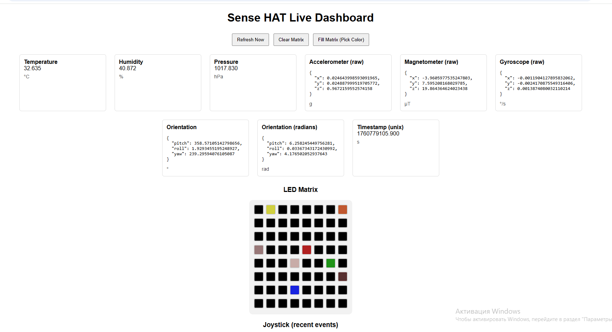

## ABOUT
Web-based application which allows for real-time observation of all the data from SenseHAT sensors in the form of GUI, as well as interaction with RGB matrix and on-board joystick. For much more detailed information click [here](./report.pdf)


## Requirements

### Hardware
- Raspberry Pi 3,4,5
- Sense HAT attached to the Raspberry Pi

### Operating System
- Raspberry Pi OS (formerly Raspbian)

### Python Dependencies
Install the required Python packages:

```bash
sudo apt-get update
sudo apt-get install sense-hat
pip3 install Flask Flask-Cors sense-hat
```

### Installation
1. Clone the repository:
```bash
git clone <repo_url>
cd <repo_name>
```
2. Run the server:
```bash
python3 sense_server.py
```
3. Open a web-browser and navigate to:
```bash
http://<raspberry_pi_ip>:5000
```
